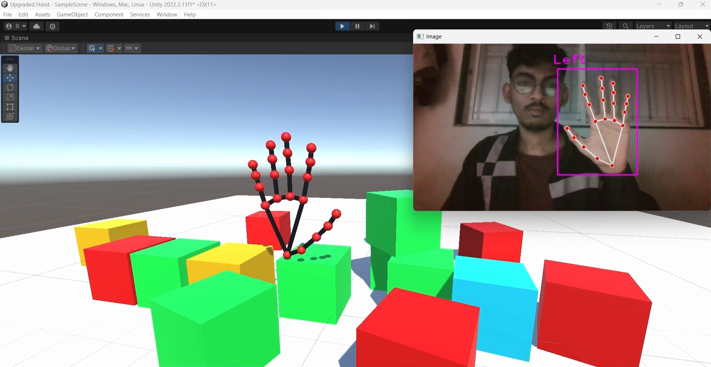

# Hand Tracking in Virtual Environment

## Overview
This project demonstrates hand tracking in a virtual environment using OpenCV, Mediapipe, Unity, and Sockets. The goal is to create an interactive 3D model that allows real-time hand tracking and virtual object interaction.



## Technologies Used
- **OpenCV**: For computer vision tasks.
- **Mediapipe**: For hand detection and tracking.
- **Unity**: For creating the 3D environment and interactions.
- **Sockets (UDP)**: For communication between the Python hand tracking script and Unity.

## Features
- Real-time hand tracking using a webcam.
- Interactive 3D hand model in Unity.
- Basic cube objects for touch and manipulation in the virtual space.
- Lines connecting hand points to visualize hand structure.

## Installation

1. Clone the repository:
   ```bash
   git clone https://github.com/adityaghode92/hand-tracking.git
   cd hand-tracking
   ```

2. **Python Dependencies**:
   Make sure you have the following libraries installed:
   ```bash
   pip install opencv-python cvzone
   ```

3. **Unity Setup**:
   - Open the Unity project.
   - Ensure the `UDPReceive` and `HandTracking` scripts are properly attached to the GameObjects.
   - Set the `port` in the `UDPReceive` script to match the one used in the Python script (default: 5052).

4. **Run the Project**:
   - Start the Python script to begin hand tracking.
   - Then, run the Unity project to visualize the hand tracking in the virtual environment.

## Usage
- Point your webcam at your hand to start tracking.
- Interact with the cubes in the Unity environment using hand gestures.

## Acknowledgments
- [OpenCV](https://opencv.org/)
- [Mediapipe](https://google.github.io/mediapipe/)
- [Unity](https://unity.com/)
